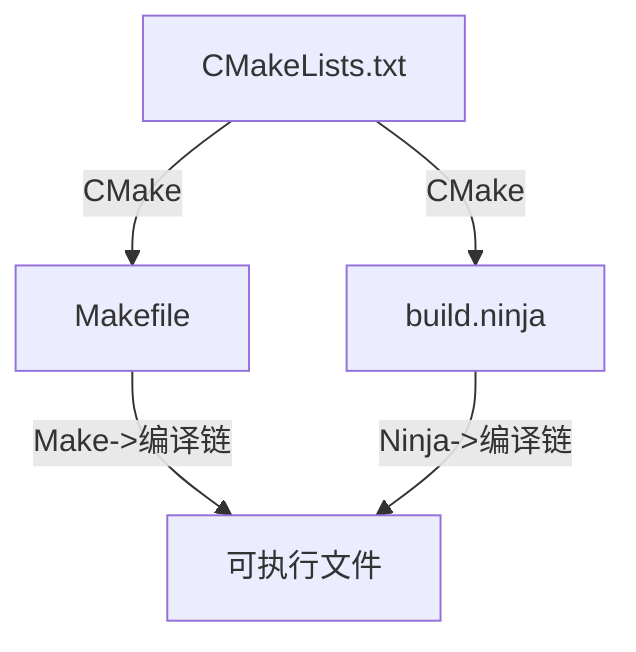

接触linux系统一段时间之后一定绕不开的一个话题就是CMake。复杂的C语言和C++项目通常都会在根目录放一个`CMakeLists.txt`，展开子目录也许会发现还有很多`CMakeLists.txt`，有时还会发现`Makefile`。那这些都是什么？又该如何使用？

> 在阅读本文前，推荐先阅读我之前写的[编译链知识文档](https://blog.jianyuewushuang.top/2026/09/01/%E7%BC%96%E8%AF%91%E9%93%BE%E7%9F%A5%E8%AF%86%E6%96%87%E6%A1%A3)这篇博文。

## CMake

CMake是读取`CMakeLists.txt`并生成Makefile或其他构建文件的程序，安装和使用方式是：

```bash
sudo apt install cmake
cd path/to/your/project
# 在CMakeLists.txt同级目录下执行
cmake .
```

CMake 会检测当前系统、编译器、库依赖，自动生成对应平台的构建文件：

- 在linux系统中，CMake会默认生成Makefile，也可生成Ninja文件等其他构建文件。
- 在windows系统中，CMake会默认生成Visual Studio 的 `.sln` 工程。如果想生成Makefile,需要先在系统中配置GCC编译链，并在执行命令时添加一些参数，如果有MSYS的话推荐优先在MSYS2 UCRT64中进行。
    > 进入MSYS2 UCRT64中执行：
    >
    > ```bash
    > # 安装CMake
    > pacman -S cmake
    > # C盘不显示，需要从根目录手动进入
    > cd /C/path/to/your/project
    > cmake
    > ```

- 在macos系统中可以生成Makefile或Xcode工程。

`CMakeLists.txt`具有platform-inclusiveness，但CMake生成的Makefile却是platform-exclusive的，所以最好维护`CMakeLists.txt`，而把`Makefile`作为构建产物。

## Make

Make是读取并执行Makefile的程序，安装和使用方式是：

```bash
sudo apt install make
cd path/to/your/project
# 在Makefile同级目录下执行
make
```

Makefile本质是自动调用工具链进行项目构建的脚本，里面指明了哪些源码需要编译、用什么参数、文件之间依赖关系、什么时候重新编译等规则。

比较不错的是，make会自动检测文件改动，只重新编译改动过的文件。

## Ninja

Ninja的定位和Make相同，CMake可以通过`CMakeLists.txt`生成`build.ninja`供Ninja读取并调用编译链构建整个项目。

Ninja最初是Google 为 Chromium 开发的，设计哲学是以最快速度执行构建任务。要说`Makefile`还具有一定的人类可读性和可写性，那`build.ninja`就是几乎完全面向机器的，它的增量构建和空构建速度都极快，而且默认并行构建。同时，`build.ninja`的跨平台性也比`Makefile`要好很多。目前很多大型项目都选择使用Ninja。

使用方式：

```bash
cmake -B build -GNinja
# 在build.ninja同级目录执行
ninja
```

## 全链路流程

### 流程图



### 最佳实践

由于CMake执行`CMakeLists.txt`时会生成大量构建产物，所以最好新建一个biuld/目录来存放构建产物。

```bash
mkdir build
cd build
# 执行上级目录的CMakeLists.txt
cmake ..
make
./可执行文件
```

CMake也可直接进行进一步构建：

```bash
cd path/to/your/project
cmake -S . -B build
# Make和Ninja通用
cmake --build build
./build/可执行文件
```

CMake有关目录的完整语法为：`cmake -S .. -B .`，`-S` 指定源码目录，`-B` 指定构建目录。

如果想用Ninja：

```bash
cd build
cmake .. -GNinja
ninja
# 或cmake --build .
./可执行文件
```

## CMakeLists.txt语法

CMake不是面向过程的编程语言，是一种声明式构建描述语言。

现代CMake推荐面向目标（target-oriented）写法，一切围绕target。

### 变量

设置变量：

```cmake
set(VAR "value")
set(SRCS main.cpp foo.cpp)
```

CMake 的变量本质是字符串；多个值就是用分号 `;` 分隔的字符串，只是书写时可以写空格。

引用变量：

```cmake
message("源文件列表：${变量名}")
```

### 注释

```cmake
# 单行注释，从 # 到行尾
#[[
多行注释
]]
```

### 列表

CMake 没有单独数组类型，变量就是列表。

```cmake
set(files a.cpp b.cpp c.cpp)
# 或
set(files "a.cpp;b.cpp;c.cpp")
```

list 命令：

```cmake
list(APPEND files d.cpp) # 在列表末尾追加元素
list(LENGTH files len)   # 获取列表长度存入 len
```

### 命令

命令调用：

```cmake
命令名(参数1 参数2 ...)
```

- CMake对大小写不敏感，一般命令大写、变量小写。
- 参数用空格/换行分隔。
- 参数带空格要用双引号 `" "` 包裹。
- 括号必须紧跟命令名，不能空格。

#### `project()` 项目声明

放在靠前位置，设置项目名、语言、版本，自动生成一些内置变量。

```cmake
project(myapp LANGUAGES C CXX VERSION 1.0.0)
```

- `LANGUAGES C`：启用C编译器(gcc)
- `LANGUAGES CXX`：启用C++编译器(g++)

内置变量自动生成：

- `${PROJECT_NAME}`：项目名 myapp
- `${PROJECT_VERSION}`：版本号

#### `add_executable()` 生成可执行文件

```cmake
add_executable(myapp main.cpp foo.cpp)
```

含义：用 `main.cpp foo.cpp` 编译，产出可执行文件 `myapp`。

#### `add_library()` 创建库

```cmake
add_library(mylib STATIC foo.cpp bar.cpp) # STATIC 静态库 .a
add_library(mylib SHARED foo.cpp bar.cpp) # SHARED 动态库 .so / .dll
```

#### `target_link_libraries()` 目标链接库

把库链接到可执行程序/另一个库

```cmake
add_executable(myapp main.cpp)
target_link_libraries(myapp PRIVATE mylib)
```

- PRIVATE：myapp 使用 mylib，mylib 的头文件只给myapp自己，不向外传递
- PUBLIC：myapp 使用mylib，同时把mylib头文件暴露给依赖myapp的其他目标
- INTERFACE：myapp不使用mylib源码，但依赖myapp的目标需要链接mylib

#### `target_include_directories()` 添加头文件搜索路径

代替 `-I` 编译参数，指定头文件目录

```cmake
target_include_directories(myapp PRIVATE ${CMAKE_SOURCE_DIR}/include)
```

内置变量 `${CMAKE_SOURCE_DIR}`：**根目录**，`CMakeLists.txt` 所在项目根路径。

#### `target_compile_options()` 设置编译选项

给目标添加 gcc/g++ 参数（如 `-Wall` 警告）

```cmake
target_compile_options(myapp PRIVATE -Wall -O2)
```

#### `message()` 打印信息，调试CMake脚本

```cmake
message(STATUS "源文件：${SRCS}") # STATUS 普通信息
message(FATAL_ERROR "错误！终止CMake") # FATAL_ERROR 直接中断
```

#### 条件判断

```cmake
if(WIN32)
    message("当前Windows平台")
elseif(UNIX)
    message("Linux/macOS")
else()
    message("未知平台")
endif()
```

常用判断：

- `if(MSVC)`：微软编译器
- `if(CMAKE_CXX_COMPILER_ID STREQUAL "GNU")`：判断编译器是GCC
- `if(EXISTS "${file_path}")` 判断文件是否存在

CMake if 里变量**不加 `${}`**，直接写变量名.

字符串比较要用 `STREQUAL`。

#### 循环

```cmake
foreach(file ${SRCS})
    message("源码文件：${file}")
endforeach()
```

#### 函数

```cmake
function(print_msg text)
    message("${text}")
endfunction()
print_msg("hello")
```

function 内部变量默认不会向外传递。

#### 宏替换

```cmake
macro(print_macro text)
    message("${text}")
endmacro()
```

无作用域。

### 内置变量

- `${CMAKE_CXX_COMPILER}`：C++编译器，一般是 `g++`
- `${CMAKE_C_COMPILER}`：C编译器，一般是 `gcc`
- `${CMAKE_CXX_STANDARD}`：C++标准，如 `17`，搭配 `CMAKE_CXX_STANDARD_REQUIRED ON`

```cmake
set(CMAKE_CXX_STANDARD 17)
set(CMAKE_CXX_STANDARD_REQUIRED ON) # 强制要求C++17，不支持就报错
```

- `${CMAKE_BINARY_DIR}`：构建输出目录

### CMakeLists.txt示例

```cmake
cmake_minimum_required(VERSION 3.16) # 要求最低CMake版本

project(demo LANGUAGES CXX VERSION 0.1)

# 设置C++17标准
set(CMAKE_CXX_STANDARD 17)
set(CMAKE_CXX_STANDARD_REQUIRED ON)

# 源码列表
set(SRCS main.cpp)

# 生成可执行文件demo
add_executable(demo ${SRCS})
```

构建流程：

```bash
mkdir build && cd build
cmake ..
make
./demo
```

## 项目实战

推荐通过<https://github.com/browny/cmake-practice>这个项目进行练习，以下是这个项目的详解。

> 这个项目年代久远，2.8版本的CMake已不可用，需要把所有`CMakeLists.txt`中的CMake版本改成3.10或更高。

### hello_world

注意out-of-source构建。

构建命令：

```bash
cd hello_world
cmake -S . -B build
make -C build
./build/hello
```

### hello_world_clear

这个项目演示了如何把可执行文件输出都单独的文件夹和如何把构建产物安装到系统目录。

根目录的`CMakeLists.txt`中的`ADD_SUBDIRECTORY(src)`指定了接着执行`./src/CMakeLists.txt`。其中`SET(EXECUTABLE_OUTPUT_PATH ${PROJECT_BINARY_DIR}/bin)`指定了可执行文件的构建路径。

构建命令：

```bash
cd hello_world_clear
cmake -S . -B build
cmake --build build
cmake --install build --prefix ~/cmakeinstall
./build/hello
```

最后那行命令会把这个项目安装到本机，具体会把脚本安装到`~/cmakeinstall/bin/`中，把可执行文件`hello`复制到系统可执行文件目录后可在本机运行，在此不再详述。`doc/hello.txt`、`COPYRIGHT`、`REARME`会被安装到`~/share/doc/cmake/hello_world_out/`中。

输出结果：

```txt
-- Install configuration: ""
-- Installing: /home/jianyuelinux/cmakeinstall/share/doc/cmake/hello_world_out/COPYRIGHT
-- Installing: /home/jianyuelinux/cmakeinstall/share/doc/cmake/hello_world_out/README
-- Installing: /home/jianyuelinux/cmakeinstall/bin/runhello.sh
-- Up-to-date: /home/jianyuelinux/cmakeinstall/share/doc/cmake/hello_world_out
-- Installing: /home/jianyuelinux/cmakeinstall/share/doc/cmake/hello_world_out/hello.txt
```

### hello_world_lib

这个项目演示了如何把代码编译成**动态库和静态库**，在此先解释静态库和动态库的概念。

C/C++编译可分为四个阶段：

1. 预处理
2. 编译
3. 汇编
4. 链接

动态库和静态库就是在链接的时候发挥作用。

#### 静态库

静态库是目标文件的归档包。在编译需要静态库的文件时，链接器会扫描静态库，把代码里用到的函数对应的目标文件从库里提取出来，然后把提取到的机器码拷贝并合并到最终的可执行文件中。链接完成后的可执行文件就不再需要静态库文件了，可单独运行整个程序。

使用静态库的缺点就是生成的可执行文件中由于包含了所需的静态库，所以体积会增大，当多个程序都链接同一个静态库时，每个文件中都会存放一份静态库，会导致磁盘占用冗余。而当静态库更新之后，整个程序必须重新编译。

在windows中，静态库为`.lib`文件，在linux中，静态库为`.a`文件。

gcc命令示例：

```bash
# 编译源码生成目标文件
gcc -c add.c -o add.o
# 打包生成静态库 libadd.a
ar rcs libadd.a add.o
# 链接静态库，生成可执行文件main
gcc main.o -L. -ladd -o main
```

CMake语法示例：

```bash
# 生成静态库
add_library(mylib STATIC add.cpp)
# 链接这个库给可执行程序
add_executable(main main.cpp)
target_link_libraries(main PRIVATE mylib)
```

#### 动态库

在链接动态库时，链接阶段只记录符号信息，不会复制动态库的代码，等程序运行时，操作系统才会把动态库加载到内存。

优缺点和静态库互补，再次不再赘述。由于动态库会加载到内存中，所以多个进程可以共享内存里同一份库副本，但同时也要注意动态库的内存占用问题。

在windows中，动态库为`.dll`，linux为`.so`，macos为`.dylib`。windows常见的找不到.dll错误就是由动态库缺失导致。同时，windows在动态库编译时会配套生成一个`.lib`导入库，这个不是静态库，只存符号表，用来在编译阶段链接`.dll`。linux系统中对应的东西叫动态符号表。

gcc命令示例：

```bash
# 生成位置无关代码
gcc -c -fPIC add.c -o add.o
# 生成动态库libadd.so
gcc -shared add.o -o libadd.so
# 链接动态库
gcc main.o -L. -ladd -o main
# 运行前需要让系统找到动态库，临时设置环境变量
export LD_LIBRARY_PATH=.
./main
```

CMake语法示例：

```cmake
# SHARED：动态库
add_library(mylib SHARED add.cpp)
add_executable(main main.cpp)
target_link_libraries(main PRIVATE mylib)
```

回到hello_world_lib这个项目，在`./src/CMakeLists.txt`中由于CMake默认会让两个target输出不同文件名，所以静态库和动态库默认文件名为`libhello_static.a`和`libhello_dynanic.so`，但为了之后链接方便，作者通过`SET_TARGET_PROPERTIES(hello_dynamic PROPERTIES OUTPUT_NAME "hello")`和`SET_TARGET_PROPERTIES(hello_static PROPERTIES OUTPUT_NAME "hello")`让`./build/lib/`中的静态库和动态库文件名分别为`libhello.a`和`libhello.so`。

构建命令：

```bash
cd hello_world_lib
cmake -S . -B build
cmake --build build
```

### hello_world_share

在上一个项目中学习了如何创建库之后，这个项目就来演示如何链接已有的库。

- `./src/CMakeLists.txt`中的`INCLUDE_DIRECTORIES(../include/hello)`给`./src/main.c`指定了在`./include/hello/hello.h`这里的头文件。

- `./src/CMakeLists.txt`中的`FIND_LIBRARY(HELLO_LIB NAMES hello PATHS "../lib/")`指定了库的位置。

要注意的是，`./lib/`中的动态库是`libhello.dylib`，说明作者的预编译是在macos上进行的，如果现在用的不是macos，刚好可以把在上个项目编译好的库复制到这里，否则会出现以下报错：

```txt
[ 50%] Building C object src/CMakeFiles/main.dir/main.c.o
[100%] Linking C executable ../bin/main
/usr/bin/x86_64-linux-gnu-ld.bfd: CMakeFiles/main.dir/main.c.o: in function `main':
main.c:(.text+0x9): undefined reference to `HelloFunc'
collect2: error: ld returned 1 exit status
gmake[2]: *** [src/CMakeFiles/main.dir/build.make:102: bin/main] Error 1
gmake[1]: *** [CMakeFiles/Makefile2:106: src/CMakeFiles/main.dir/all] Error 2
gmake: *** [Makefile:91: all] Error 2
```

构建命令：

```bash
cmake -S . -B build
cmake --build build
./build/bin/main
```
