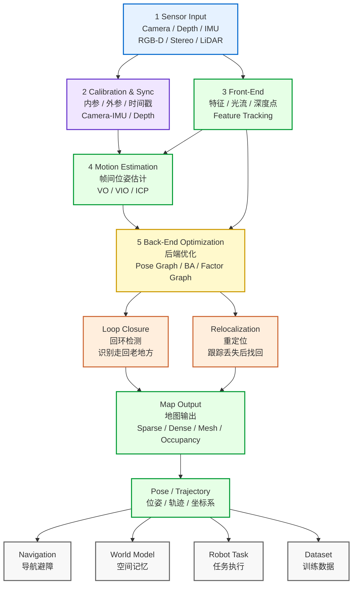
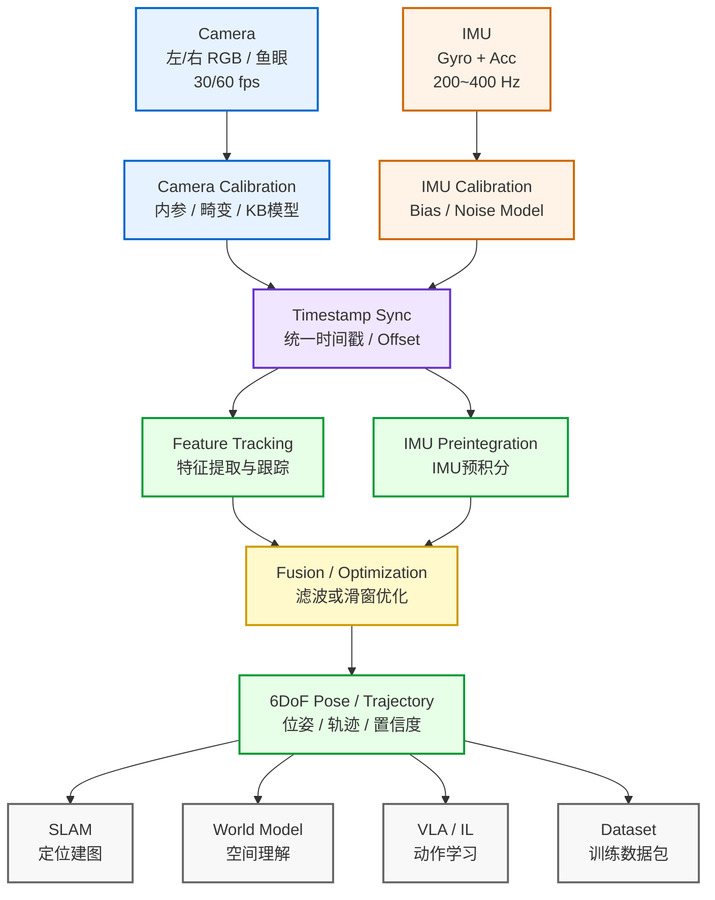
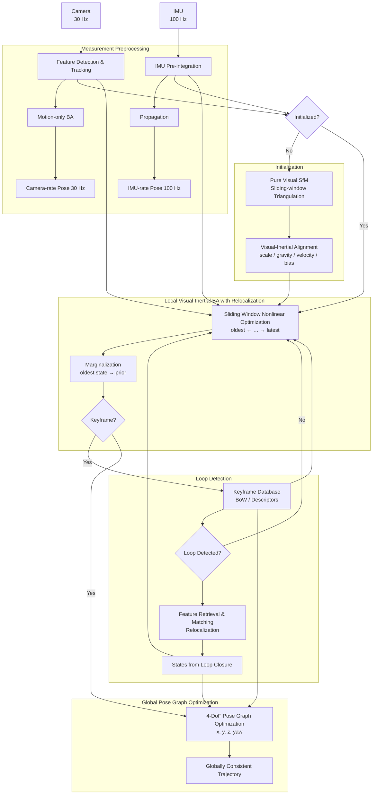

## 前置知识

### 四大坐标系

#### 1. 世界坐标系 World Coordinate System ($X_w,Y_w,Z_w$)

- **定义**：全局三维参考坐标系，描述**相机和物体在真实世界里的位置**。单位：米/m。
- 原点可以自己定：比如标定板一角、机器人基座、场地原点。
- 作用：描述场景中物体、相机的三维位姿。
- 变换到相机坐标系：**外参（旋转矩阵R + 平移向量t）**

$$
\begin{bmatrix}X_c\\Y_c\\Z_c\end{bmatrix} = R\begin{bmatrix}X_w\\Y_w\\Z_w\end{bmatrix}+t
$$

#### 2. 相机坐标系 Camera Coordinate System ($X_c,Y_c,Z_c$)

- **定义**：以**相机光心**为原点的三维坐标系。单位：米/m。
- 约定：
  - $Z_c$：相机光轴，指向拍摄前方；
  - $X_c$：向右；
  - $Y_c$：向下。
- 这一步还是**3D点**，还没投影到图片平面。
- 变换到归一化图像平面：**针孔相机投影**

$$
x = \frac{X_c}{Z_c},\quad y=\frac{Y_c}{Z_c}
$$
> \((x,y)\)就是**归一化图像坐标系**

#### 3. 归一化图像坐标系（图像坐标系）Normalized Image Plane \((x,y)\)

> 光心在图像中心、**无焦距、无像素**的虚拟平面。

- 原点：光轴与成像平面交点（图像主点）；
- x向右，y向下；
- 单位：**无量纲**（除以$Z_c$消去了长度单位）；
- 物理含义：把三维点投影到**焦距f=1**的虚拟成像平面，脱离相机焦距影响，方便后续畸变矫正。

归一化坐标是一个理想平面，再通过相机内参就能转化为像素坐标，能被计算机读取识别。畸变也是在归一化坐标上产生的。

逆向建模时像素坐标会转化成畸变归一化坐标，去畸变之后会得到理想归一化坐标，才能进行后续PnP、三角化等处理得到相机坐标系。

> PnP(Perspective-n-Point)解决的问题：给定3D点的坐标、对应2D点坐标以及内参矩阵，求解相机的位姿。也就是已知世界坐标系和像素坐标系下的坐标和相机内参，求解外参。这样可以确定相机的位置，也就是机器人的位置。

#### 4. 像素坐标系 Pixel Coordinate System \((u,v)\)

- **定义**：图片像素的二维坐标系，就是OpenCV里读到图片直接用的坐标。单位：像素 px。
- 原点：**图片左上角**；
- $u$：横向像素序号；$v$：纵向像素序号。
- 从归一化坐标转到像素坐标：**相机内参K**

$$
\begin{cases}
u = f_x \cdot x + c_x \\
v = f_y \cdot y + c_y
\end{cases}
$$
写成矩阵形式：
$$
\begin{bmatrix}u\\v\\1\end{bmatrix}=
\begin{bmatrix}
f_x & 0 & c_x \\
0 & f_y & c_y \\
0 & 0 & 1
\end{bmatrix}
\begin{bmatrix}x\\y\\1\end{bmatrix}
$$

- $f_x,f_y$：x/y方向焦距（像素）；
- $c_x,c_y$：主点坐标（像素，图像中心偏移）。

#### 完整转换

$$
Z_c\begin{bmatrix}u\\v\\1\end{bmatrix}
= K\Big(R\begin{bmatrix}X_w\\Y_w\\Z_w\end{bmatrix}+t\Big)
$$

1. $X_w,Y_w,Z_w$：世界3D点
2. \(R,t\)外参 → 相机坐标系 X_c,Y_c,Z_c
3. 除以$Z_c$ → 归一化图像坐标 \((x,y)\)
4. 内参$K$ → 像素坐标 \((u,v)\)

|坐标系|维度|原点|单位|核心作用|
|---|---|---|---|---|
|世界坐标系|3D|场景自定义原点|m|描述物体、相机全局位置|
|相机坐标系|3D|相机光心|m|以相机为中心描述空间点|
|归一化图像坐标系|2D|图像主点|无量纲|针孔投影、畸变矫正|
|像素坐标系|2D|图像左上角|像素|图片读取、绘图|

关于坐标系和内参、外参的概念推荐看[这篇文章](https://blog.csdn.net/fengbingchun/article/details/130039337)。

## SLAM

VIO仅实时输出自身位置，长时间运行会持续漂移，没办法记忆环境；SLAM(Simultaneous Localization and Mapping, 同步定位于建图)依靠前端特征跟踪、后端全局优化、回环检测和重定位，越走地图精度越高。



VIO属于SLAM的帧间位姿估计部分。

[MATLAB对SLAM的介绍](https://ww2.mathworks.cn/discovery/slam.html)

## VIO

VIO(Visual-Inertial Odometry, 视觉惯性里程计)的作用是实时输出设备的6自由度位姿。相机负责观测环境提取特征，但暗光、快速转动时易丢失定位；高频IMU感知自身运动，却存在持续漂移。依靠硬件时间戳同步串联两路数据，通过特征追踪与IMU预积分融合修正误差。



主流VIO开源方案：

| VIO框架 | 耦合方案 | 后端方案 | 前端 | 视觉误差 | 初始化 | 回环 | 精度 | 效率 |
| ---- | ---- | ---- | ---- | ---- | ---- | ---- | ---- | ---- |
| MSF | 松耦合 | 滤波EKF | \ | \ | \ | \ | 最差1 | 最快5 |
| MSCKF | 紧耦合 | 滤波EKF | fast+光流 | 重投影 | 静止 | 无 | 较差2 | 较快4 |
| ROVIOLI、Maplab | 紧耦合 | 滤波IEKF | fast+光度 | 光度 | 静止 | 无 | 一般3 | 较快4 |
| OKVIS | 紧耦合 | 优化 | fast+brisk | 重投影 | 静止 | 无 | 较好4 | 最慢1 |
| VINS | 紧耦合 | 优化 | fast+光流 | 重投影 | 动态 | 有 | 最好5 | 较慢2 |
| ORB-SLAM3 | 紧耦合 | 优化 | orb | 重投影 | 动态 | 有 | \ | \ |
| ICE-BA | 紧耦合 | 优化 | fast+光流 | 重投影 | 静止 | 无 | \ | \ |

商业VIO：Google的Project Tango和已经被苹果收购的Flyby Media。

VIO进行视觉和惯性融合的原因：

- 相机：纹理丰富、长期漂移小，双目还能直接给尺度和深度；但怕运动模糊、弱纹理、遮挡、光照突变，且输出频率低（10–60 Hz）。
- IMU： 输出频率高（100–1000 Hz）、短期精度高，能扛剧烈运动，并提供重力方向与米制尺度；但零偏和噪声会让位置误差快速发散。

融合后IMU做帧间外推，视觉反过来在线估计并修正 IMU 零偏、抑制漂移；二者还一起解决了单目尺度模糊和初始化问题，最终能输出高频、低漂移、带尺度的位姿。

单目视觉 SLAM 算法存在一些本身框架无法克服的缺陷，首先是尺度的问题 ，单目 SLAM 处理的图像帧丢失了环境的深度信息，即使通过对极约束和三角化恢复了空间路标点的三维信息，但是这个过程的深度恢复的刻度是任意的，并不是实际的物理尺度，导致的结果就是单目SLAM 估计出的运动轨迹即使形状吻合但是尺寸大小却不是实际轨迹尺寸；由于基于视觉特征点进行三角化的精度和帧间位移是有关系的，当相机进行近似旋转运动的时候，三角化算法会退化导致特征点跟踪丢失，同时视觉 SLAM 一般采取第一帧作为世界坐标系，这样估计出的位姿是相对于第一帧图像的位姿，而不是相对于地球水平面 (世界坐标系) 的位姿，后者却是导航中真正需要的位姿，换言之，视觉方法估计的位姿不能和重力方向对齐。

过引入 IMU 信息可以很好地解决上述问题，首先通过将 IMU 估计的位姿序列和相机估计的位姿序列对齐可以估计出相机轨迹的真实尺度，而且 IMU 可以很好地预测出图像帧的位姿以及上一时刻特征点在下帧图像的位置，提高特征跟踪算法匹配速度和应对快速旋转的算法鲁棒性，最后 IMU 中加速度计提供的重力向量可以将估计的位置转为实际导航需要的世界坐标系中。同时，智能手机等移动终端对 MEMS 器件和摄像头的大量需求大大降低了两种传感器的价格成本；硬件实现上， MEMS 器件也可以直接嵌入到摄像头电路板上。综合以上，融合 IMU 和视觉信息的 VINS 算法可以很大程度地提高单目 SLAM 算法性能，是一种低成本高性能的导航方案，在机器人、AR/VR 领域得到了很大的关注。
目前VIO的框架可以按照是否把图像特征信息加入状态向量分为两大类：

- 松耦合（Loosely Coupled），是指IMU和相机分别进行自身的运动估计，然后对其位姿估计结果进行融合。
- 紧耦合（Tightly Coupled），是指把IMU的状态与相机的状态合并在一起，共同构建运动方程和观测方程，然后进行状态估计。
    紧耦合理论也分为 基于滤波(filter-based) 和 基于优化(optimization-based) 两个方向。滤波方面，传统的EKF以及改进的MSCKF（Multi-State Constraint KF）都取得了一定的成果，优化方面亦有相应的方案。

VIO的需要标定三类参数：

1. 内参
    - 相机内参
    - IMU内参
    - 相机畸变参数
2. 外参
    - 相机-IMU外参
    - 双目外参
    - 多传感器的IMU-GNSS外参等
3. 时间偏移
    - 相机图像曝光时刻 和 IMU 采样时刻的时间差
    - 相机曝光时间
    - 卷帘快门的快门读出时间

相机-IMU标定的目的是获取两个传感器坐标系之间的空间关系和数据延迟，是VIO系统工作的前提工作。相机-IMU标定可以看成状态估计的逆过程，标定是通过标定板获取每个时刻的精确运动状态，计算出模型参数（坐标系间旋转位移、时间延迟、IMUbias，也就是外参），而运动估计则是在已知两个传感器坐标系间的模型参数，估计每个时刻的运动状态。

相机-IMU标定需要事先知道相机和IMU的内参，IMU内参即陀螺仪加速度计的噪声参数。

参数标定工具：Kalibr。

## VINS

VINS(Visual-Inertial Navigation System，视觉惯性导航系统)是用VIO作为前端的SLAM，由HKUST港科大Aerial Robotics实验室开源，有两个常用版本：

1. **VINS-Mono**：单目相机 + IMU，最小传感器组合，单目恢复尺度，适合无人机、AR。
2. **VINS-Fusion**：VINS-Mono扩展，支持双目、多相机、甚至GPS/激光融合，地面机器人、自动驾驶仿真常用。

以下是VINS的架构：



## 项目

### OpenVINS

项目地址：<https://github.com/rpng/open_vins>

OpenVINS 是基于 MSCKF（多状态约束卡尔曼滤波）的开源滤波器型 VIO 视觉惯性里程计，由 RPNG（Robotics Perception Group）发布，支持多相机 + 在线标定。

下面是用docker运行OpenVINS的方法：

#### 安装docker

可以参考我之前写的这篇博文：[容器技术文档](https://blog.jianyuewushuang.top/2026/05/12/%E5%AE%B9%E5%99%A8%E6%8A%80%E6%9C%AF%E6%96%87%E6%A1%A3)

#### 安装ROS或ROS2

参考ROS官网即可。

#### 使用docker运行项目

创建一个工作文件夹，在该文件夹执行：

```bash
mkdir src
cd src
# 克隆源码仓库
git clone https://github.com/rpng/open_vins
cd open_vins
# 构建docker镜像（以
docker build -t ov_ros2_22_04 -f Dockerfile_ros2_22_04 .
```

配置启动函数（以ROS2 Humble版本为例）：

在`~/.zshrc`中写入：

```bash
xhost + &> /dev/null

ov_docker() {
  docker run -it --net=host --gpus all \
    --env="NVIDIA_DRIVER_CAPABILITIES=all" \
    --env="DISPLAY" \
    --env="QT_X11_NO_MITSHM=1" \
    --volume="/tmp/.X11-unix:/tmp/.X11-unix:rw" \
    --mount type=bind,source=/home/jianyuelinux/documents/ROS2/open_vins,target=/catkin_ws \
    --mount type=bind,source=/home/jianyuelinux/documents/ROS2/datasets,target=/datasets \
    "$@"
}
```

> 没有 NVIDIA 显卡 / 没装 nvidia-docker 时 ，把`--gpus all --env="NVIDIA_DRIVER_CAPABILITIES=all"` 两行删掉。`--net=host` 让容器间 ROS2 网络互通；`DISPLAY` +`/tmp/.X11-unix` +`QT_X11_NO_MITSHM=1` 负责把 rviz2 显示到桌面。每次重启电脑后需重新执行`xhost +` 。

然后执行：

```bash
source ~/.zshrc
# 创建一个新的容器并启动并进入容器
ov_docker ov_ros2_22_04 bash
```

进入容器后执行：

```bash
cd /catkin_ws
# 编译项目
colcon build --event-handlers console_cohesion+
source install/setup.bash
```

编译产物会写入挂载目录`/catkin_ws/install` ，也就是宿主机`<工作文件夹>/install` ， 下次不用重新编译 。

> 之后每开一个新容器，都要先`source /catkin_ws/install/setup.bash` 才能找到`ov_msckf` 包。

编译完之后就可以退出并停止容器了，由于编译产物已经写入宿主机目录，所以也可以删除这个容器。

退出容器：

```bash
exit
# 容器的生命周期就是该进程的生命周期，此时容器将会停止运行
```

删除容器：

```bash
docker ps -a               # 列出所有容器
docker rm <容器ID或名字>      # 删除单个已停止的容器
docker container prune     # 删除所有已停止的容器
```

#### 跑仿真

仿真配置文件：`open_vins/config/rpng_sim/estimator_config.yaml`
轨迹文件：`open_vins/ov_data/sim/tum_corridor1_512_16_okvis.txt`

在终端中执行：

```bash
# 每次重启电脑后执行一次
xhost +
# 会创建一个新容器并进入
ov_docker ov_ros2_22_04 bash
# 在容器内执行
cd /catkin_ws
source install/setup.bash
# 开启rviz可视化窗口，之后在 rviz 里可以看到估计轨迹与特征点云
rviz2 -d /catkin_ws/src/open_vins/ov_msckf/launch/display_ros2.rviz
```

在另一个终端中执行：

```bash
# 查看容器 ID
docker ps
# 再次进入同一个容器
docker exec -it <容器ID或名字> bash
# 在这个容器中执行
cd /catkin_ws
source install/setup.bash
# 运行仿真估计器
ros2 run ov_msckf run_simulation src/open_vins/config/rpng_sim/estimator_config.yaml --ros-args -r __ns:=/ov_msckf
```

#### 跑TUM-VI数据集

数据集主页：<https://cvg.cit.tum.de/data/datasets/visual-inertial-dataset>

ros1数据集下载链接：<https://cdn2.vision.in.tum.de/tumvi/calibrated/512_16/dataset-room1_512_16.bag>

下载到数据集目录中后需把ros1的`.bag`包转换为ros2数据集。执行：

```bash
python3 -m venv .venv
source .venv/bin/activate 
pip install rosbags
rosbags-convert --src dataset-room1_512_16.bag --dst tumvi_room1_ros2
# 检验转换是否成功
ros2 bag info tumvi_room1_ros2
```

需输出这几个话题：

- `/cam0/image_raw`
- `/cam1/image_raw`
- `/imu0`

进入`tumvi_room1_ros2/`，把`metadata.yaml`里的`type_description_hash:`的值和所有`[]`改成`""`。

在终端中执行：

```bash
# 只允许本机 (local) 上 root 用户连接 X Server，不开放给网络(docker 容器内部 root 用户跑 RViz、rqt、VINS 可视化)
xhost +si:localuser:root
# 结束后用xhost -local:root回收权限
# 创建一个新容器并进入
ov_docker ov_ros2_22_04 bash
# 在容器内执行
cd /catkin_ws
source install/setup.bash
# 再次检查能否输出那几个话题
ros2 bag info /datasets/tumvi_room1_ros2
# 启动rviz
rviz2 -d /catkin_ws/src/open_vins/ov_msckf/launch/display_ros2.rviz
```

在另一个终端中执行：

```bash
# 查看容器 ID
docker ps
# 再次进入同一个容器
docker exec -it <容器ID或名字> bash
# 在这个容器中执行
cd /catkin_ws
source install/setup.bash
# 启动估计器
ros2 run ov_msckf run_subscribe_msckf --ros-args -p config_path:=/catkin_ws/src/open_vins/config/tum_vi/estimator_config.yaml -r __ns:=/ov_msckf
```

在另一个终端中执行：

```bash
# 查看容器 ID
docker ps
# 再次进入同一个容器
docker exec -it <容器ID或名字> bash
# 在这个容器中执行
cd /catkin_ws
source install/setup.bash
# 使用播放器播放数据集
ros2 bag play /datasets/tumvi_room1_ros2
```

rviz 会实时显示轨迹与特征。

### VINS-Fusion

项目地址：<https://github.com/HKUST-Aerial-Robotics/VINS-Fusion>

VINS-Fusion是香港科技大学沈劭劼团队，基于 VINS-Mono 扩展的、基于滑动窗口非线性优化(VI-BA)的紧耦合VINS，支持多种传感器配置，自带回环，还可融合 GPS。

下面使用docker运行VINS-Fusion的方法：

#### 下载EuRoC数据集

从HuggingFace上的镜像仓库`kavehsgh/EuRoC_MAV_Dataset_Machine_Hall_Easy_01`下载：

```bash
wget -c --tries=10 --timeout=30 --waitretry=5 --progress=dot:giga "https://hf-mirror.com/datasets/kavehsgh/EuRoC_MAV_Dataset_Machine_Hall_Easy_01/resolve/main/MH_01_easy.bag"
```

#### 启动容器

项目基础镜像是`ros:kinetic-perception` （perception 变体）， 不包含 rviz （rviz 在`desktop` 变体里），项目的 Dockerfile 也没装它，所以官方 run.sh 把 rviz 放在宿主机跑。但宿主机如果装的不是ros1就运行不了，这样就需要自己安装rviz。有以下几种方法：

1. 修改项目的Dockerfile

    ```dockerfile
    RUN apt-get update && \
        apt-get install -y --no-install-recommends ros-${ROS_DISTRO}-rviz && \
        rm -rf /var/lib/apt/lists/*
    ```

    然后重新构建：

    ```bash
    cd <工作区目录>/VINS-Fusion/docker
    make build
    ```

2. 每次进入容器之后手动安装

    ```bash
    # 容器内执行
    apt-get update && apt-get install -y ros-kinetic-rviz
    ```

然后再宿主机上执行：

```bash
# 只允许本机 (local) 上 root 用户连接 X Server，不开放给网络(docker 容器内部 root 用户跑 RViz、rqt、VINS 可视化)
xhost +si:localuser:root
# 结束后用xhost -local:root回收权限
# 启动docker容器
docker run -it --rm --name vins-fusion \
  --net=host \
  -e DISPLAY= $DISPLAY -e QT_X11_NO_MITSHM=1 \
  -v /tmp/.X11-unix:/tmp/.X11-unix:rw \
  -v $HOME /documents/code/projects/VINS-Fusion:/root/catkin_ws/src/VINS-Fusion \
  -v $HOME /documents/ROS2/datasets:/root/datasets:ro \
  ros:vins-fusion
# 或
docker run -it --rm --name vins-fusion --net=host -e DISPLAY=$DISPLAY -e QT_X11_NO_MITSHM=1 -v /tmp/.X11-unix:/tmp/.X11-unix:rw -v $HOME/documents/code/projects/VINS-Fusion:/root/catkin_ws/src/VINS-Fusion -v $HOME/documents/ROS2/datasets:/root/datasets:ro ros:vins-fusion
```

容器内运行：

```bash
roscore &
sleep 2
# 双目 + IMU（对应 README 3.2 节）
rosrun vins vins_node /root/catkin_ws/src/VINS-Fusion/config/euroc/euroc_stereo_imu_config.yaml &
# 可选：回环检测（红色轨迹）
rosrun loop_fusion loop_fusion_node /root/catkin_ws/src/VINS-Fusion/config/euroc/euroc_stereo_imu_config.yaml &
# 可选：可视化
rviz -d /root/catkin_ws/src/VINS-Fusion/config/vins_rviz_config.rviz &
rosbag play /root/datasets/EuRoc/MH_01_easy.bag

# 或只执行
roscore &
sleep 2
rosrun vins vins_node /root/catkin_ws/src/VINS-Fusion/config/euroc/euroc_stereo_imu_config.yaml &
roslaunch vins vins_rviz.launch &
sleep 3
rosbag play /root/datasets/EuRoc/MH_01_easy.bag
```

需要回环检测再加一条：`rosrun loop_fusion loop_fusion_node <同一个配置文件>` 。

想换模式只需换配置文件（README 3.1/3.3 节）：

- 单目+IMU：`config/euroc/euroc_mono_imu_config.yaml`
- 纯双目：`config/euroc/euroc_stereo_config.yaml`

> 小笔记：
>
> - `cmd1 && cmd2`：串行，等待 cmd1，**只有 cmd1 成功才执行 cmd2**
> - `cmd1 ; cmd2`：串行，等待 cmd1，**无论 cmd1 成败都执行 cmd2**
> - `cmd1 & cmd2`：并行，不等待 cmd1，两条一起跑
