[官方文档](https://docs.mermaidviewer.com/zh/) [官方平台](https://mermaidviewer.com/)

## 流程图

### 示例

#### 基础示例

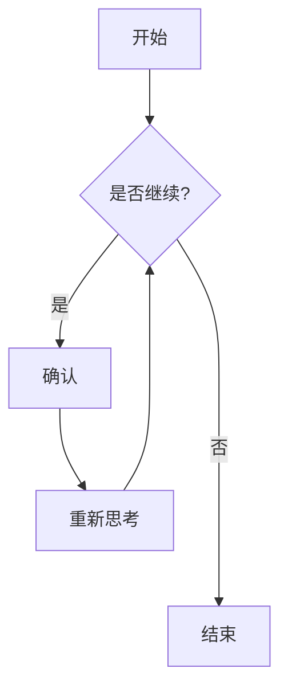

#### 高级示例

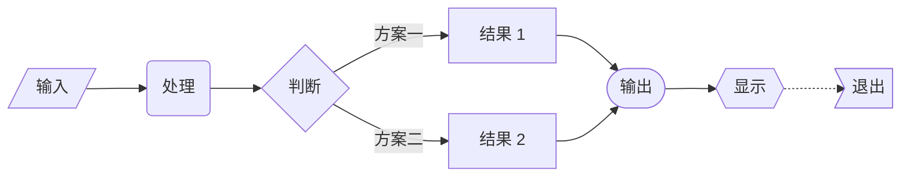

#### 子图

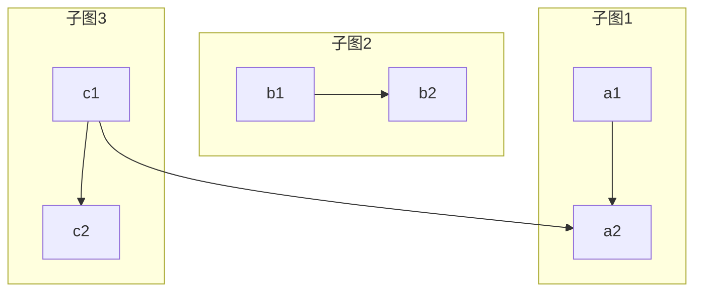

#### 样式设置

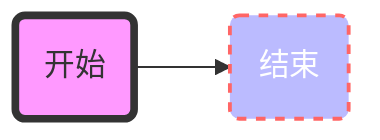

#### 转义字符

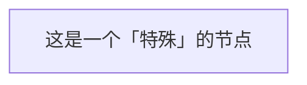

#### 多行文本

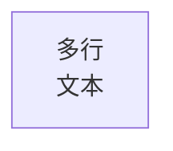

#### 交互式图表

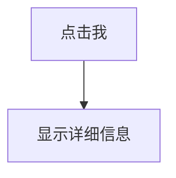

## 时序图

### 示例

#### 基础示例

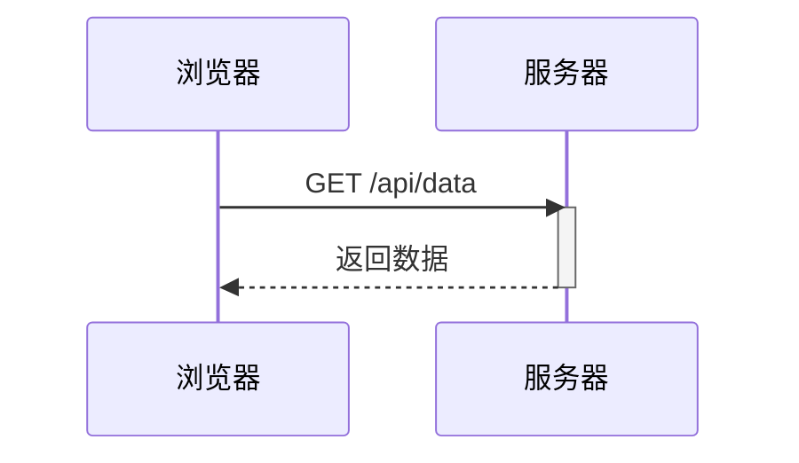

#### 高级示例

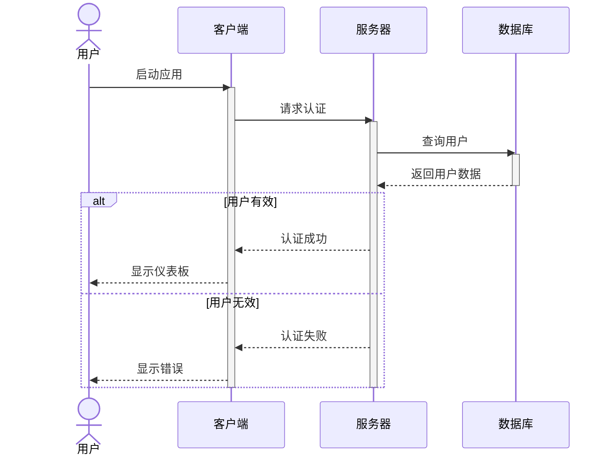

#### 注释

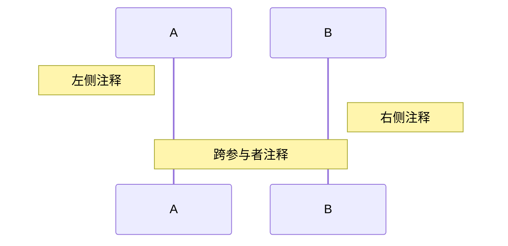

#### 循环

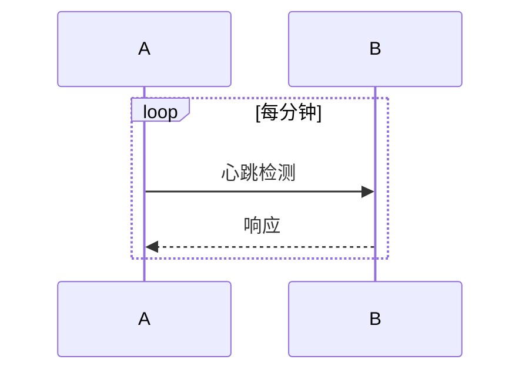

## 类图

### 示例

#### 基础示例

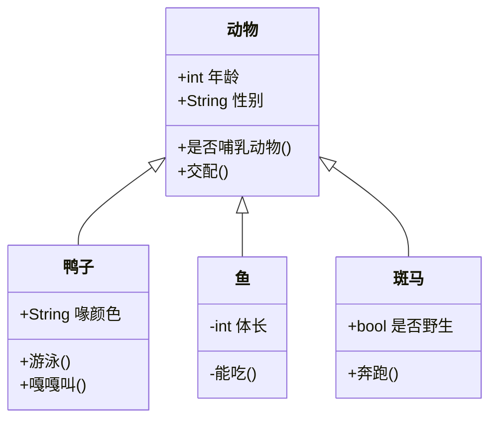

#### 高级示例

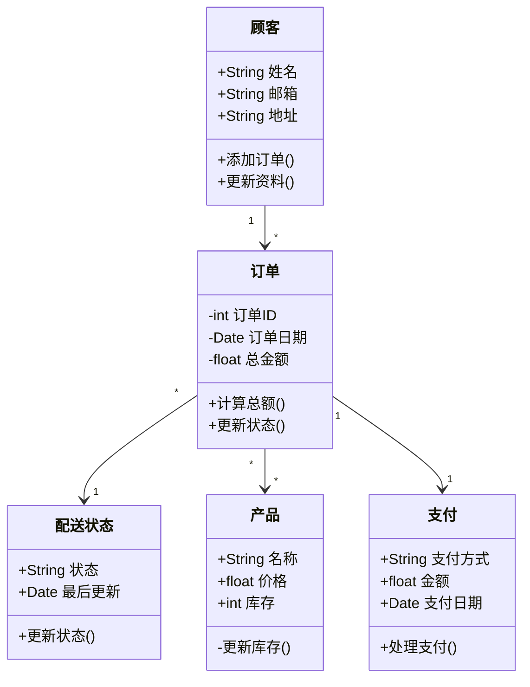

#### 泛型类型

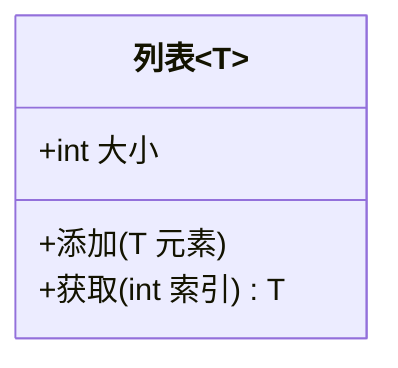

#### 接口

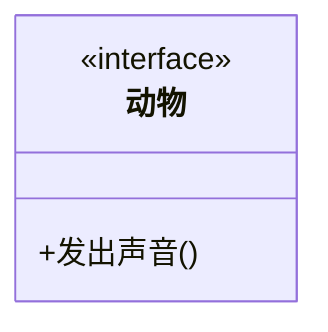

#### 抽象类


## 状态图

### 示例

#### 基础示例

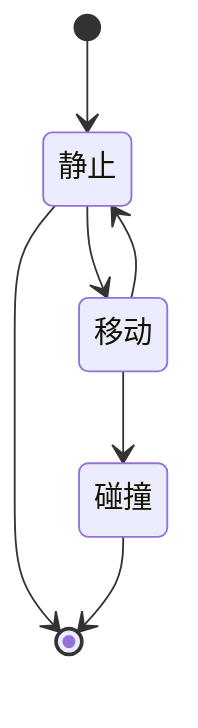

#### 高级示例

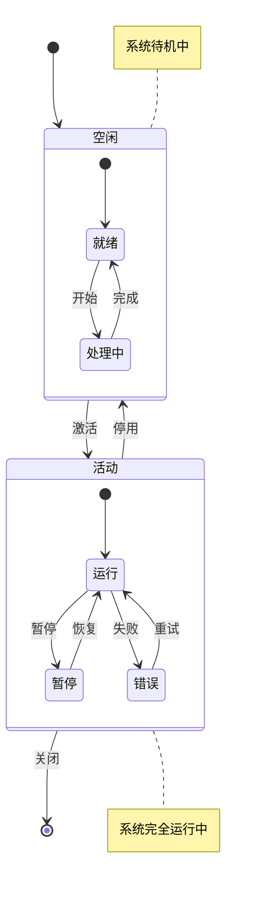

#### 复合状态

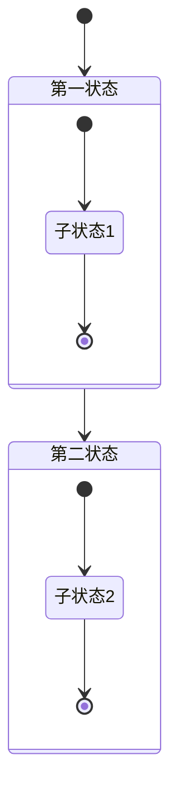

#### 选择点

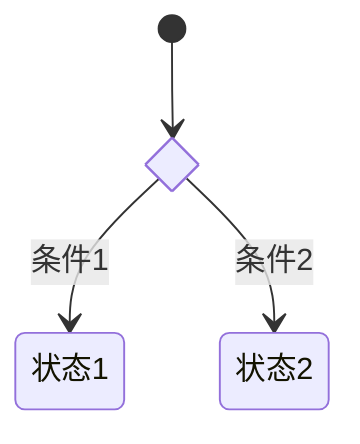

#### 并行状态

```mermaid
stateDiagram-v2
    [*] --> 活动状态
    
    state 活动状态 {
        state "CPU运行" as CPU
        state "磁盘I/O" as IO
        --
        state "内存访问" as 内存
    }
```

## 实体关系图

### 示例

#### 基础示例

```mermaid
erDiagram
    客户 ||--o{ 订单 : 下单
    订单 ||--|{ 订单项目 : 包含
    产品 ||--o{ 订单项目 : "包含于"
```

#### 高级示例

```mermaid
erDiagram
    用户 ||--o{ 文章 : 撰写
    用户 ||--o{ 评论 : 发表
    用户 {
        int 用户ID
        string 用户名
        string 邮箱
        string 密码
        date 创建时间
    }
    文章 ||--o{ 评论 : 包含
    文章 ||--o{ 分类 : 属于
    文章 {
        int 文章ID
        string 标题
        text 内容
        date 发布时间
        bool 是否发布
    }
    评论 {
        int 评论ID
        text 内容
        date 创建时间
    }
    分类 {
        int 分类ID
        string 名称
        string 别名
    }
```

#### 属性和类型

```mermaid
erDiagram
    客户 {
        int 客户ID PK
        string 姓名
        string 邮箱 UK
        date 注册时间
    }
    订单 {
        int 订单ID PK
        int 客户ID FK
        decimal 总金额
        date 订单日期
    }
```

#### 关系标签

```mermaid
erDiagram
    医生 ||--o{ 预约 : "安排"
    患者 ||--o{ 预约 : "预约"
    预约 ||--|| 处方 : "产生"
```

#### 附加功能

```mermaid
erDiagram
    产品 {
        int 产品ID PK
        string 名称 UK
        decimal 价格
        int 分类ID FK
    }
```

## 用户旅程图

### 示例

#### 基础示例

```mermaid
journey
    title 购物体验
    section 浏览
        访问网站: 5: 用户
        搜索商品: 4: 用户
        查看详情: 3: 用户
    section 购买
        加入购物车: 5: 用户
        结算: 4: 用户
        支付: 3: 用户
```

#### 高级示例

```mermaid
journey
    title 电子商务用户体验
    section 发现
        浏览首页: 5: 顾客
        搜索商品: 4: 顾客
        查看分类: 4: 顾客
    section 研究
        阅读详情: 5: 顾客
        查看评价: 3: 顾客
        比较价格: 4: 顾客
    section 购买
        加入购物车: 5: 顾客
        填写地址: 2: 顾客
        选择支付: 3: 顾客
        完成支付: 4: 顾客
    section 售后
        追踪订单: 5: 顾客
        收货确认: 4: 顾客
        评价商品: 3: 顾客
```

#### 多角色示例

```mermaid
journey
    title 餐厅点餐流程
    section 点餐
        浏览菜单: 5: 顾客
        记录点单: 4: 服务员
        处理订单: 3: 厨师
    section 准备
        烹饪食物: 4: 厨师
        质量检查: 5: 主厨
    section 服务
        上菜: 5: 服务员
        用餐体验: 4: 顾客
```

## 甘特图

### 示例

#### 基础示例

```mermaid
gantt
    title 简单项目进度
    dateFormat  YYYY-MM-DD
    section 规划
    项目启动    :a1, 2024-01-01, 1w
    需求收集    :a2, after a1, 2w
    section 开发
    实现        :a3, after a2, 4w
    测试        :a4, after a3, 2w
```

#### 高级示例

```mermaid
gantt
    title 软件开发项目
    dateFormat  YYYY-MM-DD
    
    section 规划
    项目启动       :done, a1, 2024-01-01, 2d
    需求分析       :active, a2, after a1, 1w
    系统设计       :a3, after a2, 2w
    
    section 开发
    后端开发      :crit, a4, after a3, 4w
    前端开发      :a5, after a3, 4w
    API集成       :a6, after a4, 1w
    
    section 测试
    单元测试      :a7, after a5, 1w
    集成测试      :a8, after a6, 2w
    用户验收      :a9, after a8, 1w
    
    section 部署
    文档编写      :a10, after a8, 1w
    培训         :a11, after a9, 4d
    上线         :milestone, a12, after a11, 0d
```

#### 任务状态

```mermaid
gantt
    title 任务状态示例
    dateFormat YYYY-MM-DD
    
    section 进度
    已完成任务    :done, t1, 2024-01-01, 1w
    当前任务      :active, t2, after t1, 1w
    关键任务      :crit, t3, after t2, 1w
    普通任务      :t4, after t3, 1w
```

#### 里程碑

```mermaid
gantt
    title 项目里程碑
    dateFormat YYYY-MM-DD
    
    section 阶段
    阶段1           :a1, 2024-01-01, 1w
    里程碑1        :milestone, m1, after a1, 0d
    阶段2           :a2, after m1, 2w
    里程碑2        :milestone, m2, after a2, 0d
```

#### 并行任务

```mermaid
gantt
    title 并行任务
    dateFormat YYYY-MM-DD
    
    section 开发
    后端  :a1, 2024-01-01, 2w
    前端  :a2, 2024-01-01, 2w
    测试  :a3, after a1 a2, 1w
```

## 饼图

### 示例

#### 基础示例

```mermaid
pie title 简单饼图
    "部分 A" : 30
    "部分 B" : 50
    "部分 C" : 20
```

#### 高级示例

```mermaid
pie showData title 日常活动分配
    "工作" : 8
    "睡眠" : 7
    "休闲" : 4
    "运动" : 1
    "其他" : 4
```

#### 主题定制

```mermaid
%%{init: {'theme': 'forest'}}%%
pie
    title 自定义主题
    "项目A" : 30
    "项目B" : 50
    "项目C" : 20
```

## git图

###　示例

#### 基础示例

```mermaid
gitGraph
    commit
    commit
    branch develop
    checkout develop
    commit
    commit
    checkout main
    merge develop
    commit
```

#### 高级示例

```mermaid
gitGraph
    commit id: "初始提交"
    commit id: "添加 README"
    branch develop
    checkout develop
    commit id: "设置项目结构"
    branch feature/login
    checkout feature/login
    commit id: "添加登录表单"
    commit id: "添加认证功能"
    checkout develop
    merge feature/login
    branch feature/dashboard
    checkout feature/dashboard
    commit id: "创建仪表板布局"
    commit id: "添加小部件"
    checkout develop
    merge feature/dashboard
    checkout main
    merge develop tag: "v1.0.0"
```

#### 分支管理

```mermaid
gitGraph
    commit
    branch develop
    checkout develop
    commit
    branch feature
    checkout feature
    commit
    commit
    checkout develop
    merge feature
    checkout main
    merge develop
```

#### 发布管理

```mermaid
gitGraph
    commit
    branch develop
    checkout develop
    commit
    branch release/1.0
    checkout release/1.0
    commit id: "版本号更新"
    checkout main
    merge release/1.0 tag: "v1.0.0"
    checkout develop
    merge main
```

#### 标签和发布

```mermaid
gitGraph
    commit
    commit tag: "v0.1.0"
    branch develop
    commit
    commit
    checkout main
    merge develop tag: "v0.2.0"
```

#### 提交挑选

```mermaid
gitGraph
    commit id: "功能-A"
    branch feature
    checkout feature
    commit id: "功能-B"
    checkout main
    cherry-pick id: "功能-B"
```

## C4架构图

### 示例

#### 基础示例

```mermaid
C4Context
    title 互联网银行系统的系统上下文图
    
    Person(customer, "银行客户", "银行的客户")
    System(banking_system, "互联网银行系统", "允许客户查看其银行账户信息")
    
    Rel(customer, banking_system, "使用")
```

##### 高级示例

```mermaid
C4Container
    title 互联网银行系统的容器图

    Person(customer, "银行客户", "银行的客户")
    
    System_Boundary(banking_system, "互联网银行系统") {
        Container(web_app, "Web应用", "Java, Spring MVC", "提供静态内容和互联网银行单页应用")
        Container(spa, "单页应用", "JavaScript, Angular", "为客户提供所有互联网银行功能")
        Container(mobile_app, "移动应用", "Kotlin, Android", "为客户提供有限的互联网银行功能")
        Container(api, "API应用", "Java, Spring Boot", "通过API提供互联网银行功能")
        ContainerDb(database, "数据库", "Oracle Database", "存储用户注册信息、加密的认证凭据、访问日志等")
    }

    Rel(customer, web_app, "使用", "HTTPS")
    Rel(customer, spa, "使用", "HTTPS")
    Rel(customer, mobile_app, "使用")
    Rel(web_app, spa, "提供")
    Rel(spa, api, "使用", "JSON/HTTPS")
    Rel(mobile_app, api, "使用", "JSON/HTTPS")
    Rel(api, database, "读写", "JDBC")
```

#### 组件级别

```mermaid
C4Component
    title 互联网银行系统API应用的组件图

    Container_Boundary(api, "API应用") {
        Component(sign_in_controller, "登录控制器", "Spring MVC Rest Controller", "允许用户登录互联网银行系统")
        Component(security_component, "安全组件", "Spring Security", "提供登录、修改密码等功能")
        Component(user_repository, "用户仓库", "Spring Data", "提供用户信息访问")
    }

    Rel(sign_in_controller, security_component, "使用")
    Rel(security_component, user_repository, "使用")
```

#### 部署图

```mermaid
C4Deployment
    title 互联网银行系统的部署图

    Deployment_Node(customer_computer, "客户电脑", "Microsoft Windows 或 Apple macOS") {
        Deployment_Node(web_browser, "Web浏览器", "Chrome, Firefox, Safari, 或 Edge") {
            Container(spa, "单页应用", "JavaScript, Angular", "为客户提供所有互联网银行功能")
        }
    }

    Deployment_Node(data_center, "数据中心") {
        Deployment_Node(server, "应用服务器", "Ubuntu 20.04 LTS") {
            Container(api, "API应用", "Java, Spring Boot")
        }
        Deployment_Node(database_server, "数据库服务器", "Oracle") {
            ContainerDb(database, "数据库", "Oracle 19c")
        }
    }

    Rel(spa, api, "调用API", "JSON/HTTPS")
    Rel(api, database, "读写", "JDBC")
```

#### 边界和企业

```mermaid
C4Context
    Enterprise_Boundary(enterprise, "银行") {
        System(banking_system, "互联网银行系统")
        System(atm_system, "ATM系统")
    }
    
    Person(customer, "客户")
    System_Ext(mail_system, "邮件系统")
    
    Rel(customer, banking_system, "使用")
    Rel(customer, atm_system, "使用ATM取款")
    Rel(banking_system, mail_system, "发送邮件")
```

## 思维导图

### 示例

#### 高级示例

```mermaid
mindmap
    root((Web开发))
        前端
            HTML
                结构
                语义
            CSS
                样式
                布局
                    Flexbox
                    Grid
                动画
            JavaScript
                DOM
                事件
                框架
                    React
                    Vue
                    Angular
        后端
            编程语言
                Python
                Node.js
                Java
            框架
                Express
                Django
                Spring
            数据库
                SQL
                    MySQL
                    PostgreSQL
                NoSQL
                    MongoDB
                    Redis
        DevOps
            版本控制
                Git
                SVN
            CI/CD
                Jenkins
                GitHub Actions
            部署
                Docker
                Kubernetes
```

#### 形状和样式

```mermaid
mindmap
    root((中心主题))
        [方括号主题]
            (圆括号主题)
                ))云形主题((
                    ))另一个云形((
        [另一个方括号主题]
            (另一个圆括号主题)
```

## 时间线

### 示例

#### 简单事件

```mermaid
timeline
    title 简单事件
    2024 : 新年
    一月 : 第1个月
    二月 : 第2个月
    三月 : 第3个月
```

#### 分组事件

```mermaid
timeline
    title 产品开发阶段
    section 研究
        市场分析 : 2周
        竞品研究 : 1周
        用户研究 : 2周
    section 设计
        线框图 : 1周
        原型设计 : 2周
        用户测试 : 1周
    section 实现
        开发 : 4周
        测试 : 2周
        发布 : 1周
```
