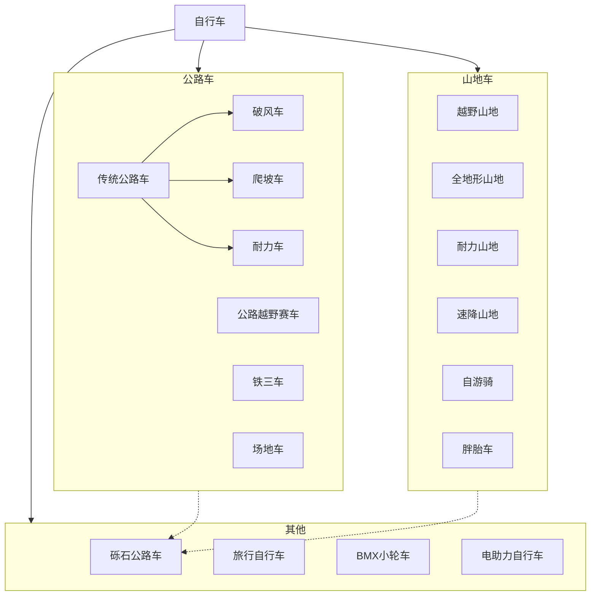

我是一个热爱运动的人，尝试过很多运动。这篇文章将会分享我对运动的看法以及我平时如何运动。

## 运动的好处

很多人都不是很注重运动，也不经常运动，运动对他们来说好像是锦上添花或者可有可无的事情，但我觉得要想更大程度发挥自己的人生价值，运动几乎是必须的。

人类在所有动物中有两个先天的种族优势，就是发达的大脑和充沛的耐力。而运动则可以很好地让这两个优势发挥出来。

### 让大脑充分运转

首先，运动对大脑思考有促进作用。

在此不再赘述科学依据和伪科学论证，就拿我举个例子：

几年前，我由于不小心滑倒，有过一次非常严重的崴脚，这导致我一个多月脚没下过地。自然没有进行任何运动。那时正值我的一段大量用脑时期。在被迫停止运动一段时间之后，我感觉我的大脑中似乎出现了一种挥之不去的脑雾，让我很难像之前那样集中精力进行高效率地长时间学习和思考。

而在我的脚痊愈之后我立即恢复了运动，没多长时间，脑子里那种晕乎乎的感觉便消失了。

此后，只要没有什么重大伤病或其他迫不得已的情况，我都会尽可能寻找合适的运动方式进行运动。

这次崴脚之后的一小段时间里，我对脚滑产生了一些心理阴影，于是在康复之后我就买了很多防滑的越野跑鞋并穿了一段时间。在穿越野跑鞋的时候，我心想：既然都穿上越野跑鞋了，那顺便尝试一下越野跑吧。于是借此契机，我接触了越野跑，并在此后成为了我最喜欢的运动项目之一。

至于我之后如何进行越野跑入门，相见后文[越野跑](#越野跑))部分。

### 使精力更加充沛

很多人在做一些事情时坚持不下来，其实很多时候不是因为懒，而是自己的身体和心理没有承受高强度和长时间高效运转的能力。而通过运动，尤其是像[长跑]()这样可以很好提高耐力的运动，可以极大程度地增强处理长耗时和高消耗的任务的能力。

运动对体力的促进作用在身体方面不用多说，但我想说的是，运动对心理方面的促进作用的重要性不比身体方面更小。很多时候在接手长难任务后或在进行长难任务中，我们会先从心理上否定自己。而在经历过长时间高强度运动的训练之后我们会对自己的体力极限有更好的把握，从而能更加精确地知道哪些任务通过努力，在自己的现有身体条件下可以完成，从而不会让自己处于不确定自己到底能不能完成的心理纠结中，更难因为心理因素被本应在自己能力范围内的任务击垮。换句话说，做事就会更加坚定，更能坚持。

## 运动的选择

根据运动目的的不同，适合的运动种类也会有所不同，这里只列举一些我经常进行的运动项目。

### 路跑

跑步的好处无需多言，比如提高耐力、心肺能力等。这是一种人类祖先赖以生存、并进行过身体结构的特化来适应这种运动方式的运动方式。人类在长跑方面有着得天独厚的先天优势，但这项运动同时也对身体素质和心理素质有着很高的要求。

#### 收益

我也认为这项运动入门并不容易，但这项运动所带来的收益也是巨大的。

1. 跑步对装备的需求并不高。
  一双合适的跑鞋和一身合身的衣服就足够开始这项运动了。而且这项运动对外部条件，如同伴、天气、场地的要求也不高，几乎可以在任何场景进行。这使得跑步虽然入门有一定困难，但在养成习惯之后反而不容易断开。
2. 通过跑步来锻炼身体的效率很高。
  跑步可以很快把心率拉高，并且对骨骼和肌肉有持续的冲击力，在运动时间不充裕的时候可以在较短时间得到很好的锻炼效果。
3. 跑步可以全方位改善身体素质。
  跑步对肌肉、骨骼、心肺等很多方面都可以起到很好的锻炼效果。
4. 跑步可以为生活带来便利。
  有些时候跑步也可以作为一种出行方式。

#### 入门

在入门阶段可以跑得慢一些，不要追求配速和距离，不要在跑步的时候看跑表的数据。因为天气、温度、跑鞋等外界因素对跑步的影响很大，入门阶段无需追求在不同环境中的适应性，只需要根据自己的体感，跑得比较舒服就可以跑快一点、跑长一点，身体不舒服的时候不要硬撑，及时停下来休息，不要追求成绩。不然在对跑步不太熟悉的情况下盲目坚持很有可能把自己跑伤，痛苦不说，还会影响之后几天的运动和生活，得不偿失。**不要强行坚持进行超出自己能力范围的运动！**

#### 跑表

关于跑表，其实非常简单，只要是专业运动品牌或大厂的跑表，基本都不会很差，至于那微乎其微的数据准确度差距，不是咱们这些普通跑者需要考虑的。所以我觉得跑表选外观好看的就行，自己戴着开心最重要。毕竟除了运动的时候，手表的装饰作用才是最重要的。

我个人很喜欢SUNNTO的手表，已经买了很多块了。其他品牌的跑表我也用过几块，使用体验上我觉得各有特点，没有明显的优劣之分。

#### 缺点

但路跑的缺点也很明显，就是伤膝盖。但也有很多方式可以减轻跑步对膝盖的损伤。

1. 选一双缓震效果好的跑鞋
2. 采用前掌跑姿
3. 通过力量训练增强膝盖周围的肌肉

#### 跑鞋

跑鞋可能是跑步过程中最需要重点关注的装备了。

我跑步的目的是锻炼身体，不追求成绩。我比较追求人类原本自然的跑姿，所以我穿宽楦零落差跑鞋比较多。我也有一些赤足鞋，我推荐有一定跑步基础的人尝试穿赤足鞋走路或慢跑，但不建议接触跑步不久的人穿赤足鞋，因为穿赤足鞋跑步受伤的风险极高，且初期会因为脚疼等比较痛苦。而且赤足鞋不仅容易让脚底受伤，而且没有任何稳定脚踝的措施，脚踝力量不足的情况下也有崴脚的风险。

零落差跑鞋可以强迫身体采用前掌跑法，这种跑法不仅会对跑步速度有一定提升，更重要的是对膝盖有很好的缓冲作用。不过在初期尝试前掌跑法时小腿可能会胀痛，这完全正常，不用刻意修整，坚持一段时间之后就会极大缓解。

我不建议在非备赛期间穿碳板跑鞋跑步。也不建议长时间穿厚底缓震跑鞋跑步。这对培养高效跑姿和锻炼身体没有帮助，属于是借助外部装备拔苗助长。但要是在备赛期间要追求成绩的话这些装备是必要的，但要循序渐进，没必要一上来就穿最顶尖的碳板跑鞋，那是给精英运动员设计的，普通人也发挥不出它们真正的实力，反而容易受伤。可能最大的作用就是心理安慰了。

我穿altra的跑鞋最多，这是一个主打宽楦零落差越野跑鞋的品牌，个人比较推荐。

#### 腰包

在尝试之后，我觉得用跑步腰包装手机和其他一些随身物品比较方便，也不会对跑步产生太大影响。

### 越野跑

在崴脚痊愈之后我尝试了越野跑，第一次就被这种在土路上跑步和与大自然亲密接触的奇妙感觉所迷住，后来就坚持了下来。

#### 越野跑鞋

越野跑鞋品牌中我仍很推荐altra。

##### 鞋底

在越野跑的初期会经常崴脚，但在训练一段时间之后就能通过建立条件反射使得在脚感受到路面起伏时就会调用对应的肌肉维持身体的平衡，防止崴脚和摔倒。在这个过程中，路感非常重要，路感的缺失会导致脚底对路面起伏判断失误，导致身体失去平衡。但越野跑的路面又非常扎脚，鞋底的防护性不够的话脚底容易被扎伤，这也就是为什么很多越野跑鞋要在鞋底加一块防护板。这样的话就需要做好路感和缓震的平衡，鞋底既不能厚到丧失路感，又不能薄到跑一会儿脚底就感到刺痛。

##### 鞋楦

我认为宽楦的越野跑鞋在越野跑时会有更强的操控感，但也有人认为宽楦增加了脚在鞋中的活动空间，在跑动时会更不稳定，

##### 稳定性

有些越野跑鞋会通过加高侧墙或在鞋面上增加胶条、飞线等方式增加稳定性，这对稳定脚踝固然有帮助，但这样会使对脚踝力量的训练效果打折，还会限制跑动过程中的灵活性。不建议大量依赖。

##### 防水性

有时越野跑也涉及到过河、踏小溪等会湿鞋的场景，应对思路大致有两种：

1. 穿防水的跑鞋，防止水进到鞋子中。
  但防水的鞋通常透气性不佳，虽然防住了从外面进来的水，但脚汗排出困难的话鞋内仍会变湿，属于拆了东墙补西墙的做法。
2. 穿排水速干的跑鞋，使鞋子从水中拿出后可以快速干燥。
  需搭配速干袜子。天气寒冷时不适用。

建议优先考虑思路2。

冬天在雪中跑步时建议穿防水鞋来阻止冰冷的雪渗进鞋内，而且天气较冷时脚上也不会出很多汗。

#### 跑姿

我非常建议在越野跑时全程采用前掌跑法。上坡时基本只能使用前掌跑法了，但在下坡时，很多人采用后掌跑法，我认为这不仅会减慢跑步速度，而且比较危险。下坡大体上可以分为两种方式：

1. 小碎步下坡
  这种下坡方式安全稳定，但下坡速度比较慢，而前掌跑法比较灵活，就可以弥补一部分下坡速度的不足。
2. 跨步下坡
  这种下坡方式非常快，但对观察地形并快速反应和脚对路面状况的复杂反射要求极高，稍有不慎就会发生失误并造成重大事故。精英选手通常采用这种下坡方式。用前掌跑法的话在脚落地后会有更多的缓冲和调整空间，可以使脚在感受到地面之后调动相应肌肉来保持身体平衡，这在高速下坡的过程中及其重要。一旦脚没有踩稳，而且没有调整空间的话极易崴脚或摔倒，这在高速下坡的过程中是所有越野跑者都望而生畏的情况。而且跨步下坡对膝盖的损伤也比较大，前掌跑法可以给膝盖提供更多缓冲从而保护膝盖。

越野跑的摆臂比较自由，顺着惯性自然摆臂即可。可以看着混乱，但不能真的乱摆。

#### 登山杖

我觉得普通人完全没有使用登山杖的必要，很多人其实也不知道如何正确使用登山杖，反而徒增跑步的负担。

#### 越野背包

需要根据自己跑的距离来选对应容量的背包。建议线下试穿以确定号码大小。

### 跳绳

跳绳同样也是一项对场地要求极低的运动，同样易于坚持，且入门没有跑步那么困难。

有人觉得跳绳的动作和正常运动正好相反。比如跳远的时候手臂要向上摆，但跳绳的过程中往上跳的时候手臂要向下摆。但我觉得这样的运动方式有助于减少重心高度的变化，这在滑旱冰和骑自行车等运动中很重要，也不见得就很别扭。

跳绳种类有很多，以锻炼身体为目的的话我推荐5到6毫米的橡胶拳击跳绳。不必追求很快的跳绳速度，可以做一些简单的花式，但不必过分追求。

### 滑旱冰

我从很小的时候就开始滑旱冰，一直到现在。我之前练过一段时间速滑，但速滑太伤脚了，最严重的时候我的脚上有五六处破皮流血的地方。我现在已经基本放弃速滑了。

我平时基本把旱冰当做一种出行方式，逛展览、去商场等都可以穿旱冰鞋，我甚至尝试过穿旱冰鞋打羽毛球。

我最喜欢的旱冰配置是高帮碳纤上鞋、90mm轮子和1mm微香蕉刀架。可以兼顾灵活与稳定。

### 自行车

自行车是一种冲击力不强的运动，这使得这种运动可以持续很长时间。而且它也可以作为一种出行方式，可以很好地把运动融入到生活之中。

自行车的种类很多，下面是一张自行车分类图。

我比较喜欢砾石公路车，平时骑得最多。

我之前对自行车还是小有研究的，很多朋友自行车出了问题都来找我修车。但我已经很久没再骑过了，原因如下：

1. 自行车不太方便运输，换个地方就没法继续骑了。
2. 马路上骑得太快不安全，骑得慢了对于我来说又起不到锻炼身体的效果，只能在休息时用来进行放松训练。
3. 自行车需要进行大量养护，比较麻烦，我懒得弄这些。

如果计划长时间骑自行车，我强烈建议去线下做一个fitting。自行车的大小号和各部件的相对位置非常重要，自己瞎调的话可能会骑得又慢又难受，还会增加受伤的风险。不仅没有体会到骑行的乐趣，还磨灭了对骑行的兴趣。

### 乒乓球

这是球类运动中我很推荐的一项。如果想通过运动进行一定社交的话乒乓球也是一个很好的选择。

### 交叉运动

强烈建议进行多项运动，而不是只进行某几项运动。很多运动项目是可以相互促进的，起到1+1>2的效果。就拿跑步来说，在运动时间相同的情况下，把所有时间用于跑步，效果不一定有在跑步中穿插适量骑行效果更好。

而旱冰、滑冰、滑雪之间也有一定的促进效果。虽然我的滑雪水平不高，但由于我练过速度轮滑，在平地上滑雪的速度很快。

在比如乒乓球、羽毛球和网球。我只练过乒乓球，但羽毛球和网球也能打个七七八八。

而不同运动中需要的平衡性、肌肉力量等几乎是通用的。

不过有些运动确实会呈现此消彼长的效果。比如短跑和长跑，二者不可兼得。在比如练长跑的人身体柔韧性普遍较差，练公路车的人身体柔韧性普遍更好。这样看来，瑜伽就不适合和长跑一起练，但可以和公路车一起练。
